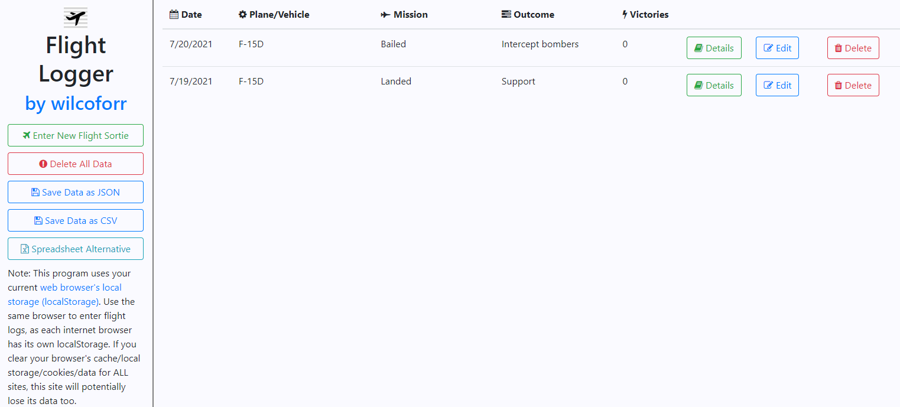

# FlightLogger

[Flight Logger](https://wilcoforr.github.io/FlightLogger/)

## Warning

Broken styles on mobile in portrait mode. Please try it out on landscape mode if you are using a phone/tablet.

## About

This program uses your current web browser's local storage (localStorage). Use the same browser to enter flight logs, as each internet browser has its own localStorage. If you clear your browser's cache/local storage/cookies/data for all sites, this site will lose its data too.

Also, do not use Flight Logger in Private/Incognito mode as the localStorage data is lost upon closing the browser.
